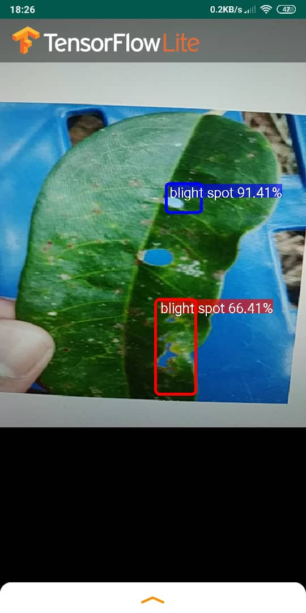

# How To Train an Object Detection Classifier for Multiple Objects Using TensorFlow (GPU) on Windows 10
**Created to store my trained model and data for my Final Year Project. (Durian Disease Detection System)

## Brief Summary
*Last updated: 18/11/2019 with TensorFlow v1.15.0*

This repository store TensorFlow's Object Detection API to train an object detection classifier for multiple objects on Windows 10, 8, or 7. (It will also work on Linux-based OSes with some minor changes.) 

**Trained model as well as tflite file to detect durian disease from leave is store in inference_tflite folder

Image below show the model is run in my android phone:

  

